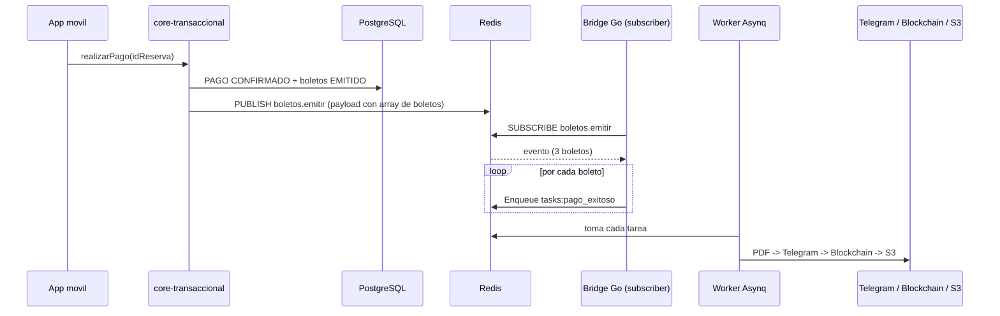

# Emisión de N boletos por reserva (mobile → core-transaccional → automatizacion_auditoria)

## Contexto y problema

Hoy los dos servicios no se comunican:

- `core-transaccional` al confirmar el pago publica un evento **Redis Pub/Sub** en `pagos.confirmados` solo con IDs (`PagoConfirmadoEventPublisher`).
- `automatizacion_auditoria` usa **Asynq** (cola persistente, otro protocolo en Redis) y espera la tarea `tasks:pago_exitoso` con el payload completo del boleto.
- Una reserva puede tener N `BOLETO_ASIENTO`, pero nada dispara la generación de PDFs.
- `automatizacion_auditoria` no puede leer PostgreSQL (regla de `AGENTS.md`).

## Decisiones (confirmadas)

- **Bridge en Go**: `automatizacion_auditoria` se suscribe a un canal Pub/Sub y desde ahí encola tareas Asynq (1 por asiento), conservando reintentos/durabilidad.
- **core-transaccional enriquece el evento**: incluye todos los datos del PDF, evitando que Go toque la BD.

## Flujo objetivo



## Lado Java: core-transaccional

Nuevo canal dedicado `boletos.emitir` (no se toca `pagos.confirmados`, que sigue alimentando BI).

- **Nuevo** `pagos/event/BoletosEmitirEventPublisher.java`: publica un JSON con datos del viaje/usuario y un array `boletos`. Una entrada por cada `BOLETO_ASIENTO` de la reserva.
- **Modificar** [PagoService.java](core-transaccional/src/main/java/com/agencia/viajes/transaccional/pagos/service/PagoService.java):
  - Construir el payload del evento **dentro de la transacción** (mientras la sesión JPA está abierta) para evitar `LazyInitializationException`. Los datos salen de objetos ya cargados: `reserva.getUsuario().getEmail()` y `getNombreCompleto()`, `reserva.getViajeProgramado().getRutaDestino()` (`getCiudadOrigen()`/`getCiudadDestino()`), `getFechaHoraSalida()` (separar en fecha y hora `HH:mm`), y `boletoAsientoRepository.findByReservaId(...)` (asiento, nombre pasajero, tipo).
  - En `registrarEventoDespuesDelCommit(...)` (afterCommit) hacer solo el `convertAndSend` del string ya construido, igual que el publisher actual.
- **Modificar** `application.properties`: añadir `app.events.boletos-emitir-channel=boletos.emitir`.

Payload propuesto:

```json
{
  "eventType": "BOLETOS_EMITIR",
  "idPago": 10,
  "idReserva": 5,
  "email": "juan@example.com",
  "origen": "Santa Cruz",
  "destino": "La Paz",
  "fecha": "2026-06-15",
  "hora": "08:30",
  "boletos": [
    { "idBoleto": 1, "asiento": "12A", "nombre": "Juan Perez", "tipoPasajero": "ADULTO" },
    { "idBoleto": 2, "asiento": "12B", "nombre": "Maria Perez", "tipoPasajero": "ADULTO" }
  ]
}
```

## Lado Go: automatizacion_auditoria

- **Modificar** [config/config.go](automatizacion_auditoria/config/config.go): añadir `BoletosEmitirChannel` (env `BOLETOS_EMITIR_CHANNEL`, default `boletos.emitir`) y un constructor `RedisClient()` que devuelva un `*redis.Client` (go-redis) reutilizando `RedisAddr`, usuario, password y TLS (la misma lógica de `AsynqRedisClientOpt`).
- **Nuevo** `internal/events/payment_subscriber.go`: se suscribe con go-redis a `boletos.emitir`, parsea el evento y, **por cada** boleto, encola una tarea `tasks:pago_exitoso` con el payload que ya consume el handler (`nombre`, `origen`, `destino`, `fecha`, `hora`, `asiento`, `email`, `id_reserva`). Usa `asynq.TaskID(idBoleto)` para idempotencia. Maneja errores con log sin tumbar el proceso.
- **Modificar** [cmd/worker/main.go](automatizacion_auditoria/cmd/worker/main.go): crear un `asynq.Client`, lanzar el subscriber en una goroutine con `context.Context`, y seguir corriendo `srv.Run(mux)`. El mismo proceso suscribe y procesa.

No cambia el handler ni el generador de PDF: el multi-asiento se resuelve encolando N tareas.

## Notas

- El diseño funciona aunque la reserva tenga 1 o N boletos (3 asientos = 3 tareas = 3 PDFs), cada uno con su hash blockchain y su archivo en S3.
- Fuera de alcance (posible siguiente paso): que `automatizacion_auditoria` devuelva `hash_blockchain`/`codigo_qr` a core para rellenar esas columnas en `BOLETO_ASIENTO`.

## Pruebas

- Local: publicar manualmente un evento en `boletos.emitir` (con `redis-cli PUBLISH` o un pequeño `cmd/test-emitir`) con 3 boletos y verificar 3 PDFs en Telegram/S3.
- End-to-end: `realizarPago` en core con una reserva de 3 asientos y observar los logs `[pago_exitoso]` del worker.