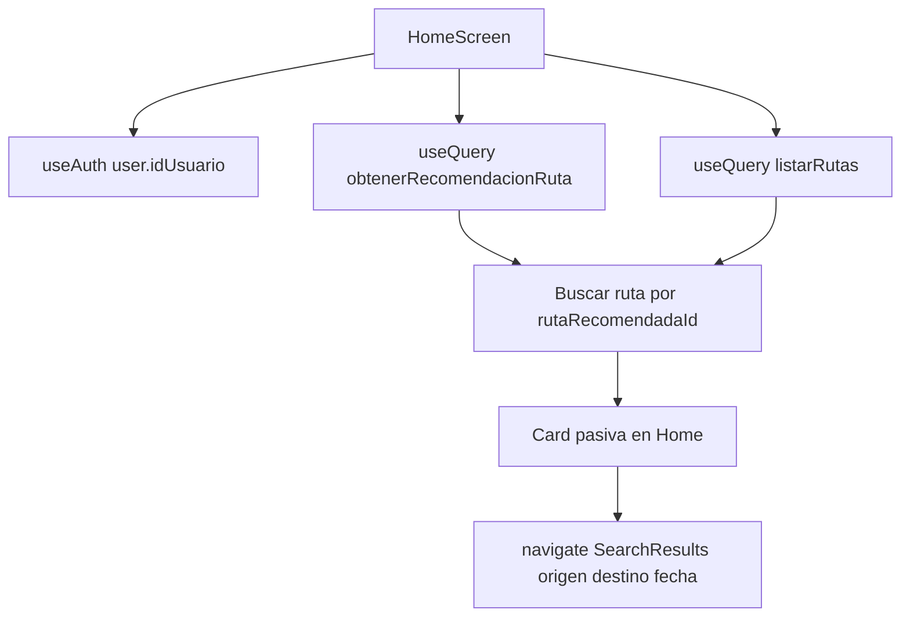

# Plan CU-09 Recomendación En Home

## Análisis Actual

La app móvil ya usa React Native con TypeScript estricto, Expo SDK 54, Apollo Client v4 y React Navigation. La comunicación del flujo transaccional debe mantenerse por GraphQL, sin REST directo desde la app para reservas o catálogo.

Archivos clave revisados:

- [app-movil-pasajero/docs/AGENTS.md](app-movil-pasajero/docs/AGENTS.md): exige Apollo GraphQL, estados `loading/error/success`, hooks/componentes funcionales y alias `@/`.
- [app-movil-pasajero/docs/Captura_de_requisitos.md](app-movil-pasajero/docs/Captura_de_requisitos.md): CU-09 no figura implementado en la app actual.
- [app-movil-pasajero/docs/GUIA_ENTORNO.md](app-movil-pasajero/docs/GUIA_ENTORNO.md): confirma Expo SDK 54 y que en dispositivo físico no se debe usar `localhost`, sino IP local.
- [app-movil-pasajero/docs/Estado app/Estado.md](app-movil-pasajero/docs/Estado app/Estado.md): Home actual cubre CU-01 y las IA de CU-06/CU-07/CU-08 siguen o han seguido patrón de simulación local; CU-09 debe integrarse con backend real.
- [app-movil-pasajero/src/screens/home/HomeScreen.tsx](app-movil-pasajero/src/screens/home/HomeScreen.tsx): actualmente renderiza un header y una card de búsqueda dentro de `View`, no `FlatList`. Usa `GET_RUTAS` para cargar origen/destino y navega a `SearchResults`.
- [app-movil-pasajero/src/graphql/queries/viajes.ts](app-movil-pasajero/src/graphql/queries/viajes.ts): contiene `GET_RUTAS` y `BUSCAR_VIAJES`; aquí debe añadirse `OBTENER_RECOMENDACION_RUTA`.
- [app-movil-pasajero/src/context/AuthContext.tsx](app-movil-pasajero/src/context/AuthContext.tsx): `useAuth()` ya expone `user?.idUsuario`, así que no hace falta crear otro hook para el ID.
- [app-movil-pasajero/src/navigation/SearchStackNavigator.tsx](app-movil-pasajero/src/navigation/SearchStackNavigator.tsx): `SearchResults` espera `{ origen, destino, fecha }`, por lo que la recomendación debe traducir `idRuta` a ciudades antes de navegar.

Flujo propuesto:



Punto importante: el resolver del core devuelve `rutaRecomendadaId`, `perfilUsuario`, `categoriaPreferida`, `topRutas` y `advertencia`, pero no devuelve origen/destino. Para evitar tocar el core, el plan usará `GET_RUTAS` para mapear `rutaRecomendadaId` contra `listarRutas.id`.

## Cambios Necesarios

1. Añadir tipos mínimos en el frontend

Crear o mantener tipos locales para evitar `any` en el nuevo flujo. Idealmente agregar en [app-movil-pasajero/src/graphql/queries/viajes.ts](app-movil-pasajero/src/graphql/queries/viajes.ts) o en un futuro archivo `src/types/viajes.ts`.

Fragmento esencial:

```ts
export interface RutaResumen {
  id: string;
  ciudadOrigen: string;
  ciudadDestino: string;
}

export interface TopRutaRecomendada {
  idRuta: number;
  probabilidad: number | null;
}

export interface RecomendacionRuta {
  rutaRecomendadaId: number | null;
  perfilUsuario: string | null;
  categoriaPreferida: string | null;
  topRutas: TopRutaRecomendada[];
  advertencia: string | null;
}
```

2. Añadir query GraphQL `OBTENER_RECOMENDACION_RUTA`

En [app-movil-pasajero/src/graphql/queries/viajes.ts](app-movil-pasajero/src/graphql/queries/viajes.ts), añadir la query. El presupuesto se omite desde Home para que el core use histórico.

Fragmento esencial:

```ts
export const OBTENER_RECOMENDACION_RUTA = gql`
  query ObtenerRecomendacionRuta($idUsuario: Int!, $presupuesto: Float) {
    obtenerRecomendacionRuta(idUsuario: $idUsuario, presupuesto: $presupuesto) {
      rutaRecomendadaId
      perfilUsuario
      categoriaPreferida
      advertencia
      topRutas {
        idRuta
        probabilidad
      }
    }
  }
`;
```

3. Crear `RecommendationCard.tsx`

Nuevo componente en [app-movil-pasajero/src/components/RecommendationCard.tsx](app-movil-pasajero/src/components/RecommendationCard.tsx). Debe ser una card pasiva, no popup. Puede reutilizar `globalStyles.card`, pero no conviene forzar `TripCard` porque `TripCard` exige `idViaje`, horarios, precio y bus, datos que CU-09 no devuelve. Mejor crear una variante visual compacta.

Props propuestas:

```ts
interface RecommendationCardProps {
  ciudadOrigen: string;
  ciudadDestino: string;
  probabilidad?: number | null;
  categoriaPreferida?: string | null;
  loading?: boolean;
  onPress: () => void;
}
```

Fragmento esencial:

```tsx
export default function RecommendationCard({
  ciudadOrigen,
  ciudadDestino,
  probabilidad,
  categoriaPreferida,
  loading = false,
  onPress,
}: RecommendationCardProps) {
  if (loading) {
    return (
      <View style={[globalStyles.card, styles.card]}>
        <View style={styles.skeletonTitle} />
        <View style={styles.skeletonLine} />
      </View>
    );
  }

  const porcentaje = typeof probabilidad === 'number'
    ? `${Math.round(probabilidad * 100)}% de afinidad`
    : null;

  return (
    <TouchableOpacity style={[globalStyles.card, styles.card]} onPress={onPress} activeOpacity={0.75}>
      <Text style={styles.badge}>Recomendado para ti</Text>
      <Text style={styles.route}>{ciudadOrigen} → {ciudadDestino}</Text>
      {categoriaPreferida ? <Text style={styles.meta}>{categoriaPreferida}</Text> : null}
      {porcentaje ? <Text style={styles.confidence}>{porcentaje}</Text> : null}
      <Text style={styles.cta}>Ver viajes disponibles</Text>
    </TouchableOpacity>
  );
}
```

4. Integrar la recomendación en `HomeScreen.tsx`

El Home actual no usa `FlatList`; para cumplir la decisión UX de card integrada en la lista, hacer una refactorización ligera:

- Mantener el header superior igual.
- Reemplazar el contenedor principal por una `FlatList` de secciones pequeñas.
- Renderizar primero `RecommendationCard` si hay usuario y recomendación válida.
- Renderizar después la card existente de búsqueda como una sección más.
- Mantener `SelectModal` fuera de la lista.

Uso de Apollo:

```tsx
const { user } = useAuth();
const idUsuario = user?.idUsuario;

const {
  data: recomendacionData,
  loading: recomendacionLoading,
  error: recomendacionError,
} = useQuery<ObtenerRecomendacionRutaData, ObtenerRecomendacionRutaVars>(OBTENER_RECOMENDACION_RUTA, {
  variables: { idUsuario: idUsuario ?? 0 },
  skip: !idUsuario,
  fetchPolicy: 'cache-first',
  nextFetchPolicy: 'cache-first',
});
```

Mapeo de `idRuta` a origen/destino con datos de `GET_RUTAS`:

```tsx
const rutaRecomendada = useMemo(() => {
  const recomendacion = recomendacionData?.obtenerRecomendacionRuta;
  if (!recomendacion?.rutaRecomendadaId || recomendacion.advertencia) return null;

  return rutas.find(
    (ruta) => Number(ruta.id) === recomendacion.rutaRecomendadaId
  ) ?? null;
}, [recomendacionData, rutas]);

const probabilidadPrincipal = recomendacionData?.obtenerRecomendacionRuta.topRutas.find(
  (topRuta) => topRuta.idRuta === recomendacionData.obtenerRecomendacionRuta.rutaRecomendadaId
)?.probabilidad;
```

Navegación al tocar:

```tsx
const handlePressRecommendation = useCallback(() => {
  if (!rutaRecomendada) return;

  navigation.navigate('SearchResults', {
    origen: rutaRecomendada.ciudadOrigen,
    destino: rutaRecomendada.ciudadDestino,
    fecha,
  });
}, [fecha, navigation, rutaRecomendada]);
```

Render de secciones:

```tsx
type HomeSection = 'recommendation' | 'searchForm';
const sections = useMemo<HomeSection[]>(() => ['recommendation', 'searchForm'], []);

<FlatList
  data={sections}
  keyExtractor={(item) => item}
  initialNumToRender={2}
  contentContainerStyle={styles.listContent}
  renderItem={({ item }) => {
    if (item === 'recommendation') {
      if (recomendacionLoading) {
        return <RecommendationCard loading ciudadOrigen="" ciudadDestino="" onPress={() => undefined} />;
      }
      if (recomendacionError || !rutaRecomendada) return null;
      return (
        <RecommendationCard
          ciudadOrigen={rutaRecomendada.ciudadOrigen}
          ciudadDestino={rutaRecomendada.ciudadDestino}
          categoriaPreferida={recomendacionData?.obtenerRecomendacionRuta.categoriaPreferida}
          probabilidad={probabilidadPrincipal}
          onPress={handlePressRecommendation}
        />
      );
    }
    return renderSearchCard();
  }}
/>
```

5. Ajustar estilos del Home

En [app-movil-pasajero/src/screens/home/styles/HomeScreen.styles.ts](app-movil-pasajero/src/screens/home/styles/HomeScreen.styles.ts), añadir solo estilos necesarios para `FlatList`, manteniendo la card del formulario.

Fragmento esencial:

```ts
listContent: {
  paddingHorizontal: SPACING.md,
  paddingTop: SPACING.sm,
  paddingBottom: SPACING.xl,
},
```

6. Mantener navegación existente

No hace falta modificar [app-movil-pasajero/src/navigation/SearchStackNavigator.tsx](app-movil-pasajero/src/navigation/SearchStackNavigator.tsx) porque `SearchResults` ya recibe `{ origen, destino, fecha }`.

La tarjeta debe navegar a:

```ts
navigation.navigate('SearchResults', {
  origen: rutaRecomendada.ciudadOrigen,
  destino: rutaRecomendada.ciudadDestino,
  fecha,
});
```

7. Ajustar `useAuth` solo si se detecta usuario nulo

[app-movil-pasajero/src/context/AuthContext.tsx](app-movil-pasajero/src/context/AuthContext.tsx) ya expone `user.idUsuario`. No modificarlo inicialmente.

Regla de comportamiento:

- Si `user` es `null`, `skip: true` en la query y no se muestra la tarjeta.
- Si el backend devuelve fallback (`advertencia` no nula) o no hay `rutaRecomendadaId`, no mostrar tarjeta para respetar el requisito de no intrusión.

8. Consideraciones de rendimiento y caché

- Usar `skip: !idUsuario` para evitar query inútil antes del login.
- Usar `cache-first` para evitar pedir recomendación en cada render.
- Usar `useMemo` para `origenesUnicos`, `destinosUnicos`, `rutaRecomendada`, `sections`.
- Usar `useCallback` para `handleSearch`, `handlePressRecommendation`, `handleOpenModal` si el refactor con `FlatList` produce re-renders.
- Evitar `network-only` en recomendación; a diferencia de resultados de viaje, no necesita refrescarse cada vez que se renderiza el Home.
- `FlatList` con `initialNumToRender={2}` basta porque habrá pocas secciones.

9. Pruebas manuales

Preparación backend:

- Motor IA en `8000`: `python manage.py runserver 0.0.0.0:8000`.
- Core transaccional en `8080`: `.\gradlew.bat bootRun`.
- En dispositivo físico, confirmar [app-movil-pasajero/src/utils/config.ts](app-movil-pasajero/src/utils/config.ts): `LOCAL_IP` debe ser la IP del equipo, no `localhost`.

Validaciones:

1. Login con usuario de prueba y abrir Home.
2. Confirmar que `OBTENER_RECOMENDACION_RUTA` llega al core y que Django registra `POST /api/recomendar-ruta/api/v1/recomendar-ruta/ 200`.
3. Ver tarjeta cerca del inicio del Home con origen/destino y porcentaje si `topRutas` tiene probabilidad.
4. Tocar la card y validar navegación a `SearchResults` con `origen`, `destino` y `fecha` del Home.
5. Apagar motor IA o forzar fallback del core: GraphQL debe devolver `advertencia`; la app no debe mostrar la card o debe mostrar mensaje muy discreto solo si se decide explícitamente.
6. Probar usuario sin historial: no mostrar tarjeta si no hay ruta mapeable.
7. Ejecutar verificación local: `npx tsc --noEmit` y `npx expo start -c` si aparece problema de caché.

## Orden De Implementación

1. Añadir tipos y `OBTENER_RECOMENDACION_RUTA` en [app-movil-pasajero/src/graphql/queries/viajes.ts](app-movil-pasajero/src/graphql/queries/viajes.ts).
2. Crear [app-movil-pasajero/src/components/RecommendationCard.tsx](app-movil-pasajero/src/components/RecommendationCard.tsx) con props estrictas, estado loading y estilos propios.
3. Refactorizar [app-movil-pasajero/src/screens/home/HomeScreen.tsx](app-movil-pasajero/src/screens/home/HomeScreen.tsx): integrar `useAuth`, query de recomendación, mapeo `rutaRecomendadaId` contra `GET_RUTAS`, y `FlatList` con secciones.
4. Añadir estilos mínimos en [app-movil-pasajero/src/screens/home/styles/HomeScreen.styles.ts](app-movil-pasajero/src/screens/home/styles/HomeScreen.styles.ts).
5. Probar con core y motor IA activos.
6. Ejecutar `npx tsc --noEmit` para validar TypeScript estricto.
7. Actualizar [app-movil-pasajero/docs/Estado app/Estado.md](app-movil-pasajero/docs/Estado app/Estado.md) marcando CU-09 como implementado, si la prueba funcional pasa.