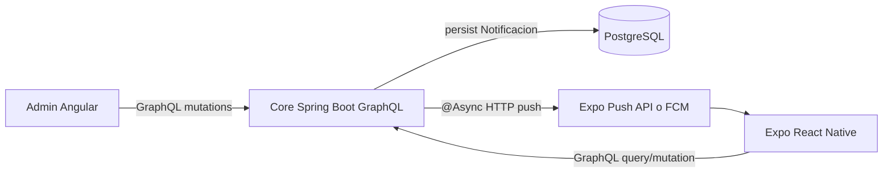

# Plan De Implementación: Notificaciones Push Reales

## Alcance Y Decisión Arquitectónica

Para el MVP se elimina Redis, worker Go y n8n. El core transaccional será dueño de la persistencia y del disparo push: primero guarda la notificación en base de datos y luego agenda el envío real con `@Async` o `CompletableFuture`, usando un cliente HTTP hacia Expo Push API o FCM.

La transacción GraphQL no debe esperar a que el proveedor push responda. El envío se ejecuta después de preparar las notificaciones y tokens, con manejo de errores interno para no romper la operación administrativa si Expo/FCM falla temporalmente.



Archivos existentes a tocar o extender:

- Backend GraphQL: [`core-transaccional/src/main/resources/graphql/schema.graphqls`](core-transaccional/src/main/resources/graphql/schema.graphqls)
- Backend rutas/viajes admin: [`core-transaccional/src/main/java/com/agencia/viajes/transaccional/rutas/service/RutasAdminService.java`](core-transaccional/src/main/java/com/agencia/viajes/transaccional/rutas/service/RutasAdminService.java)
- Configuración Spring para async/HTTP client: `core-transaccional/src/main/java/com/agencia/viajes/transaccional/config/`
- Móvil notificaciones mock: [`app-movil-pasajero/src/screens/home/NotificacionesScreen.tsx`](app-movil-pasajero/src/screens/home/NotificacionesScreen.tsx)
- Móvil badge fijo: [`app-movil-pasajero/src/navigation/DrawerNavigator.tsx`](app-movil-pasajero/src/navigation/DrawerNavigator.tsx)
- Cliente Apollo móvil: [`app-movil-pasajero/src/graphql/client.ts`](app-movil-pasajero/src/graphql/client.ts)
- Admin GraphQL service: [`frontend-web-admin/src/app/core/services/graphql.service.ts`](frontend-web-admin/src/app/core/services/graphql.service.ts)
- Admin viajes: [`frontend-web-admin/src/app/features/inventory/viajes/viajes.ts`](frontend-web-admin/src/app/features/inventory/viajes/viajes.ts)

## 1. Arquitectura De Datos

Crear un módulo `notificaciones` en el core con estas entidades:

- `Notificacion`
  - `id_notificacion`: PK
  - `id_usuario`: FK a `USUARIO.id_usuario`
  - `tipo`: enum/string controlado: `EMERGENCIA_RUTA`, `DOCUMENTACION_FALTANTE`, `CAMBIO_HORARIO`, `CANCELACION`, `RETRASO`
  - `titulo`
  - `mensaje`
  - `fecha_creacion`
  - `leido`
  - `datos_extra_json`: texto JSON para `idViaje`, `idRuta`, origen/destino, fecha anterior/nueva, severidad, origen admin
- `DispositivoPush`
  - `id_dispositivo`: PK
  - `id_usuario`: FK
  - `token`: Expo push token o FCM registration token
  - `plataforma`: `ANDROID`, `IOS`, `WEB`
  - `activo`
  - `fecha_registro`, `fecha_ultima_actualizacion`

Ejemplo de entidad base:

```java
@Entity
@Table(name = "NOTIFICACION")
public class Notificacion {
    @Id
    @GeneratedValue(strategy = GenerationType.IDENTITY)
    @Column(name = "id_notificacion")
    private Integer id;

    @ManyToOne(fetch = FetchType.LAZY, optional = false)
    @JoinColumn(name = "id_usuario", nullable = false)
    private Usuario usuario;

    @Column(name = "tipo", nullable = false, length = 40)
    private String tipo;

    @Column(name = "titulo", nullable = false, length = 120)
    private String titulo;

    @Column(name = "mensaje", nullable = false, length = 500)
    private String mensaje;

    @Column(name = "fecha_creacion", nullable = false)
    private LocalDateTime fechaCreacion;

    @Column(name = "leido", nullable = false)
    private boolean leido;

    @Column(name = "datos_extra_json", columnDefinition = "TEXT")
    private String datosExtraJson;
}
```

Definir índices:

- `idx_notificacion_usuario_fecha` sobre `(id_usuario, fecha_creacion desc)`
- `idx_notificacion_usuario_leido` sobre `(id_usuario, leido)`
- `uk_dispositivo_push_token` sobre `token`

## 2. Contrato GraphQL

Extender [`schema.graphqls`](core-transaccional/src/main/resources/graphql/schema.graphqls) con types, inputs, filtros y paginación, manteniendo el estilo actual `PaginaX`.

```graphql
enum TipoNotificacion {
  EMERGENCIA_RUTA
  DOCUMENTACION_FALTANTE
  CAMBIO_HORARIO
  CANCELACION
  RETRASO
}

enum FiltroNotificacion {
  TODAS
  LEIDAS
  NO_LEIDAS
}

type Notificacion {
  id: ID!
  idUsuario: ID!
  tipo: TipoNotificacion!
  titulo: String!
  mensaje: String!
  fechaCreacion: String!
  leido: Boolean!
  datosExtraJson: String
}

type PaginaNotificaciones {
  contenido: [Notificacion!]!
  totalPaginas: Int!
  totalElementos: Int!
  paginaActual: Int!
  tieneSiguiente: Boolean!
  totalNoLeidas: Int!
}

input NotificacionViajeInput {
  idViaje: Int!
  tipo: TipoNotificacion!
  titulo: String!
  mensaje: String!
  datosExtraJson: String
}

input NotificacionUsuarioInput {
  idsUsuario: [Int!]!
  tipo: TipoNotificacion!
  titulo: String!
  mensaje: String!
  datosExtraJson: String
}

input RegistrarDispositivoPushInput {
  idUsuario: Int!
  token: String!
  plataforma: String!
}

extend type Query {
  obtenerNotificacionesUsuario(idUsuario: Int!, estado: FiltroNotificacion = TODAS, pagina: Int = 0, tamanio: Int = 20): PaginaNotificaciones!
  contarNotificacionesNoLeidas(idUsuario: Int!): Int!
}

extend type Mutation {
  enviarNotificacionPorViaje(input: NotificacionViajeInput!): [Notificacion!]!
  enviarNotificacionPorUsuario(input: NotificacionUsuarioInput!): [Notificacion!]!
  marcarNotificacionLeida(id: ID!): Notificacion!
  marcarTodasNotificacionesLeidas(idUsuario: Int!): Boolean!
  registrarDispositivoPush(input: RegistrarDispositivoPushInput!): Boolean!
  desactivarDispositivoPush(token: String!): Boolean!
}
```

Nota de seguridad: idealmente `idUsuario` debería salir del JWT y no del argumento GraphQL para queries del pasajero. Como el repo actual ya pasa `idUsuario` desde el móvil en varios casos, se puede mantener para consistencia del MVP y reforzarlo luego con validación del `SecurityGraphQlInterceptor`.

## 3. Cambios En Backend Core

Crear paquete:

- `core-transaccional/src/main/java/com/agencia/viajes/transaccional/notificaciones/model/`
- `core-transaccional/src/main/java/com/agencia/viajes/transaccional/notificaciones/repository/`
- `core-transaccional/src/main/java/com/agencia/viajes/transaccional/notificaciones/dto/`
- `core-transaccional/src/main/java/com/agencia/viajes/transaccional/notificaciones/service/`
- `core-transaccional/src/main/java/com/agencia/viajes/transaccional/notificaciones/graphql/`
- `core-transaccional/src/main/java/com/agencia/viajes/transaccional/notificaciones/push/`

Servicios principales:

- `NotificacionService`
  - `enviarPorViaje(input)`: obtiene pasajeros afectados por reservas activas del viaje, crea una notificación por usuario, consulta tokens activos y delega el envío push asíncrono.
  - `enviarPorUsuarios(input)`: crea notificaciones directas para uno o varios usuarios y delega el envío push asíncrono.
  - `obtenerNotificacionesUsuario(...)`: query paginada con filtro por leídas/no leídas.
  - `marcarLeida(id)` y `marcarTodasLeidas(idUsuario)`.
- `DispositivoPushService`
  - `registrarToken(idUsuario, token, plataforma)`: upsert por token.
  - `desactivarToken(token)`: baja lógica.
- `PushNotificationService`
  - `enviarAsync(notificaciones, tokens)`: método `@Async` que arma payloads y llama al gateway configurado.
- `PushGateway`
  - Interfaz con implementación `ExpoPushGateway` para MVP o `FcmPushGateway` si se decide FCM directo.
- `PushSendResultHandler`
  - Registra errores, desactiva tokens inválidos y deja trazabilidad mínima del resultado.

Agregar query a `ReservaRepository` para pasajeros afectados:

```java
@Query("""
    SELECT DISTINCT r.usuario.id
    FROM Reserva r
    WHERE r.viajeProgramado.id = :idViaje
      AND r.estadoReserva <> 'CANCELADA'
    """)
List<Integer> buscarIdsUsuariosActivosPorViaje(@Param("idViaje") Integer idViaje);
```

Ejemplo de gateway para Expo Push API:

```java
public interface PushGateway {
    void enviar(List<PushMessage> mensajes);
}

@Service
@RequiredArgsConstructor
public class ExpoPushGateway implements PushGateway {
    private final RestClient restClient;

    @Override
    public void enviar(List<PushMessage> mensajes) {
        restClient.post()
                .uri("https://exp.host/--/api/v2/push/send")
                .body(mensajes)
                .retrieve()
                .toBodilessEntity();
    }
}
```

Ejemplo de servicio asíncrono:

```java
@Service
@RequiredArgsConstructor
public class PushNotificationService {
    private final PushGateway pushGateway;

    @Async("pushTaskExecutor")
    public CompletableFuture<Void> enviarAsync(List<PushMessage> mensajes) {
        if (mensajes.isEmpty()) {
            return CompletableFuture.completedFuture(null);
        }
        pushGateway.enviar(mensajes);
        return CompletableFuture.completedFuture(null);
    }
}
```

Integrar notificaciones automáticas en [`RutasAdminService`](core-transaccional/src/main/java/com/agencia/viajes/transaccional/rutas/service/RutasAdminService.java):

- En `actualizarViajeProgramado(...)`, comparar `fechaHoraSalida` anterior vs nueva.
  - Si cambia: `tipo = CAMBIO_HORARIO`.
  - Si se necesita modelar retraso formalmente, agregar `registrarRetrasoViaje(idViaje, minutosRetraso, motivo)` o permitir `estadoViaje = RETRASADO`.
- En `cancelarViajeProgramado(...)`, después de persistir `CANCELADO`, llamar `notificacionService.enviarPorViaje(...)` con `tipo = CANCELACION`.
- Para emergencia, exponer explícitamente `enviarNotificacionPorViaje` desde el panel admin.
- Para documentación faltante, exponer `enviarNotificacionPorUsuario` desde el panel admin y opcionalmente guardar un flag futuro `documentacionPendiente` si el dominio de usuario lo requiere.

## 4. Integración Push Real

Ruta MVP:

- Core persiste `Notificacion`.
- Core consulta tokens activos en `DispositivoPush`.
- Core llama a `PushNotificationService.enviarAsync(...)`.
- `PushNotificationService` ejecuta el envío HTTP fuera del hilo de la mutación GraphQL.
- Si Expo/FCM devuelve token inválido, el core marca el token como inactivo.
- Si el proveedor falla temporalmente, se registra el error. Para MVP no se requiere cola de reintentos persistente; si se quiere robustez extra, agregar campos `estado_envio`, `intentos_envio`, `ultimo_error_envio` en `Notificacion` o una tabla `NOTIFICACION_ENVIO`.

Para Expo React Native hay dos opciones:

- MVP más simple: usar Expo Push Token y Expo Push API desde el core. Sigue funcionando sobre FCM/APNs por debajo y requiere menos configuración nativa.
- FCM directo: configurar Firebase Android/iOS, `google-services.json`, credenciales EAS, y registrar `Notifications.getDevicePushTokenAsync()` en vez de `getExpoPushTokenAsync()`.

Recomendación MVP: Expo Push API, porque el proyecto ya usa `expo-notifications` y reduce configuración nativa. FCM directo queda como fase posterior si se requiere control completo del proveedor.

Ejemplo móvil de registro de token:

```ts
const tokenData = await Notifications.getExpoPushTokenAsync({
  projectId: Constants.expoConfig?.extra?.eas?.projectId,
});
await registrarDispositivoPush({
  variables: {
    input: {
      idUsuario: Number(user.idUsuario),
      token: tokenData.data,
      plataforma: Platform.OS.toUpperCase(),
    },
  },
});
```

## 5. Cambios En Frontend Móvil React Native

Crear operaciones GraphQL:

- `app-movil-pasajero/src/graphql/queries/notificaciones.ts`
- `app-movil-pasajero/src/graphql/mutations/notificaciones.ts`

Ejemplo:

```ts
export const OBTENER_NOTIFICACIONES_USUARIO = gql`
  query ObtenerNotificaciones($idUsuario: Int!, $estado: FiltroNotificacion, $pagina: Int, $tamanio: Int) {
    obtenerNotificacionesUsuario(idUsuario: $idUsuario, estado: $estado, pagina: $pagina, tamanio: $tamanio) {
      contenido {
        id
        tipo
        titulo
        mensaje
        fechaCreacion
        leido
        datosExtraJson
      }
      totalNoLeidas
      tieneSiguiente
      paginaActual
    }
  }
`;
```

Actualizar [`NotificacionesScreen.tsx`](app-movil-pasajero/src/screens/home/NotificacionesScreen.tsx):

- Eliminar `MOCK_NOTIFICACIONES`.
- Usar `useAuth()` para `idUsuario`.
- Usar `useQuery` con `fetchPolicy: 'cache-and-network'`.
- Implementar paginación con `fetchMore` si se desea scroll infinito.
- `marcarLeida(id)` llamará la mutación real y actualizará cache Apollo.
- `marcarTodoLeido()` llamará `marcarTodasNotificacionesLeidas(idUsuario)`.
- El switch `pushActivo` debe activar/desactivar registro de token, no disparar notificaciones locales cada 5 segundos.
- Mantener `Notifications.setNotificationHandler` y canal Android.

Actualizar badge en [`DrawerNavigator.tsx`](app-movil-pasajero/src/navigation/DrawerNavigator.tsx):

- Reemplazar `NOTIF_BADGE_COUNT = 3` por un hook `useUnreadNotificationsCount()`.
- Usar polling ligero (`pollInterval: 30000`) para MVP.
- Refrescar al recibir una notificación foreground con `Notifications.addNotificationReceivedListener`.
- Opcional: crear `NotificationProvider` para compartir `unreadCount` entre header y pantalla.

Tiempo real:

- MVP recomendado: polling cada 30 segundos y refetch al abrir la app/pantalla.
- Fase 2: GraphQL subscriptions sobre WebSocket si el core ya soporta subscriptions; hoy el cliente Apollo móvil está solo con `HttpLink`, así que subscription implicaría añadir `GraphQLWsLink` y configuración backend adicional.

## 6. Cambios En Admin Angular

Extender [`GraphqlService`](frontend-web-admin/src/app/core/services/graphql.service.ts) con:

- `enviarNotificacionPorViaje(input)`
- `enviarNotificacionPorUsuario(input)`
- `actualizarViajeProgramado(...)`, si aún no está expuesto en el servicio web
- `cancelarViajeProgramado(idViaje)`
- `listarUsuarios()` para seleccionar pasajero en documentación pendiente

Actualizar [`viajes.ts`](frontend-web-admin/src/app/features/inventory/viajes/viajes.ts) y [`viajes.html`](frontend-web-admin/src/app/features/inventory/viajes/viajes.html):

- Agregar botón `Enviar alerta` por viaje.
- Agregar modal con `tipo = EMERGENCIA_RUTA`, `titulo`, `mensaje`.
- Agregar acciones `Editar horario` y `Cancelar viaje`; el backend enviará notificaciones automáticas.
- Mostrar confirmación con cantidad de pasajeros notificados.

Crear pantalla o sección admin para documentación:

- Opción rápida: agregar módulo `features/inventory/usuarios` si no existe, consumiendo `listarUsuarios`.
- Opción mínima: modal/buscador dentro de una pantalla administrativa existente para seleccionar usuario y disparar `DOCUMENTACION_FALTANTE`.

Ejemplo de mutación admin:

```ts
enviarNotificacionPorViaje(input: {
  idViaje: number;
  tipo: string;
  titulo: string;
  mensaje: string;
  datosExtraJson?: string;
}) {
  const query = `
    mutation EnviarNotifViaje($input: NotificacionViajeInput!) {
      enviarNotificacionPorViaje(input: $input) {
        id
        idUsuario
        tipo
        titulo
        fechaCreacion
      }
    }
  `;
  return this.executeQuery<any>(query, { input }).pipe(map(data => data.enviarNotificacionPorViaje));
}
```

## 7. Plan De Pruebas

Backend unitario/integración:

- `enviarNotificacionPorViaje` crea una notificación por usuario con reserva activa y excluye reservas canceladas.
- `enviarNotificacionPorUsuario` soporta usuario único y lista.
- `obtenerNotificacionesUsuario` respeta filtros `TODAS`, `LEIDAS`, `NO_LEIDAS` y paginación.
- `marcarNotificacionLeida` cambia solo la notificación del usuario correcto.
- `cancelarViajeProgramado` dispara `CANCELACION` después de persistir estado.
- `actualizarViajeProgramado` dispara `CAMBIO_HORARIO` solo si cambia fecha/hora.
- `PushNotificationService` se ejecuta de forma asíncrona y no bloquea la mutación GraphQL.
- `ExpoPushGateway` o `FcmPushGateway` arma el payload correcto y maneja errores del proveedor.
- Tokens inválidos se marcan como inactivos.

Móvil:

- Login, registro de token y persistencia del dispositivo.
- Pantalla de notificaciones carga datos reales.
- Tap en tarjeta marca como leída y actualiza badge.
- `Marcar todo como leído` baja el contador a cero.
- Foreground notification dispara refetch.
- Sin permisos push, el centro de notificaciones sigue funcionando porque depende de GraphQL.

Admin Angular:

- Enviar emergencia por viaje crea notificaciones para todos los pasajeros afectados.
- Documentación pendiente crea notificación solo para el pasajero seleccionado.
- Cancelar viaje notifica automáticamente.
- Cambiar horario notifica automáticamente.
- Validaciones de formulario: viaje obligatorio, mensaje no vacío, rol administrador.

Prueba end-to-end manual:

1. Pasajero reserva/paga un viaje.
2. Móvil registra token push al iniciar sesión.
3. Admin abre `Programación de Viajes` y envía alerta de emergencia.
4. Verificar fila en `NOTIFICACION`, llamada HTTP a Expo/FCM y push recibido.
5. Abrir `NotificacionesScreen`, confirmar que aparece la alerta persistida.
6. Marcar como leída, confirmar badge actualizado.
7. Cancelar o cambiar horario del viaje y repetir validación.

## 8. Estimación

- Diseño DB, entidades JPA, repositorios y migración SQL: 4 a 6 horas.
- Schema GraphQL, DTOs, resolver y servicio de notificaciones: 6 a 8 horas.
- Integración con viajes/reservas y automatismos de notificación: 4 a 6 horas.
- Registro y gestión de tokens push: 3 a 5 horas.
- Cliente HTTP push directo en Spring Boot con `@Async`: 4 a 7 horas.
- Móvil: queries/mutations, reemplazo de mocks, badge real, token registration: 6 a 9 horas.
- Admin Angular: formulario emergencia, documentación pendiente, acciones automáticas en viajes: 6 a 10 horas.
- Pruebas backend, móvil, admin y e2e manual: 6 a 8 horas.

Estimación total MVP directo desde Spring Boot: 33 a 49 horas. Si se usa Expo Push API, se mantiene en el rango bajo. Si se exige FCM directo con credenciales EAS/Firebase y pruebas en dispositivo físico, añadir 4 a 8 horas por configuración y validación.

## 9. Orden Recomendado De Implementación

1. Crear modelo `Notificacion` y `DispositivoPush`, repositorios y schema GraphQL.
2. Implementar queries/mutations base sin push real, validando persistencia desde GraphQL.
3. Integrar `ReservaRepository.buscarIdsUsuariosActivosPorViaje` y automatismos en `RutasAdminService`.
4. Configurar `@EnableAsync`, `pushTaskExecutor` y el gateway HTTP de Expo Push API o FCM.
5. Reemplazar mock móvil por GraphQL y badge real con polling.
6. Registrar token push desde móvil.
7. Agregar formularios admin para emergencia y documentación pendiente.
8. Conectar envío push real directo desde el core y manejar tokens inválidos.
9. Ejecutar pruebas e2e por cada tipo de notificación.