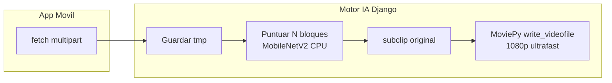
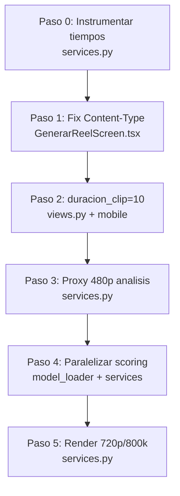

# Plan de optimización CU-07 — Generación de Reels

## Diagnóstico del pipeline actual



**Archivos clave hoy:**
- Backend: [`motor_ia/deeplearning/CU07_generar_reels/api_reels/services.py`](motor_ia/deeplearning/CU07_generar_reels/api_reels/services.py) — pipeline secuencial
- Scoring: [`motor_ia/deeplearning/CU07_generar_reels/api_reels/model_loader.py`](motor_ia/deeplearning/CU07_generar_reels/api_reels/model_loader.py) — `predict()` por fotograma
- API: [`motor_ia/deeplearning/CU07_generar_reels/api_reels/views.py`](motor_ia/deeplearning/CU07_generar_reels/api_reels/views.py) — `duracion_clip` default **5**
- Frontend: [`app-movil-pasajero/src/screens/home/GenerarReelScreen.tsx`](app-movil-pasajero/src/screens/home/GenerarReelScreen.tsx) — **`Content-Type: multipart/form-data` manual** (líneas 131-134)

**Caso de referencia** (documentado en [`CU07_Generar_Reels_2026-06-05.md`](motor_ia/docs/estado_motor_ia/CU07_Generar_Reels_2026-06-05.md)): video ~5 min, reel 60s, clip 5s → **64 bloques analizados**, **12 clips seleccionados**, ~**120s** total.

Desglose estimado del tiempo actual:

| Fase | % aprox. | Cuellos de botella |
|------|----------|-------------------|
| Upload móvil → Django | 10-15% | Header `Content-Type` roto, video sin comprimir |
| Puntuación secuencial | 45-55% | `get_frame()` en resolución original + 64× `model.predict()` |
| Extracción subclips | 5-10% | `subclip()` sobre video original (correcto) |
| Render MoviePy | 30-40% | Resolución/bitrate de entrada = salida, sin límite de bitrate |

---

## Análisis de impacto por mejora

Estimaciones sobre el caso de referencia (120s baseline). No son aditivas al 100% porque las fases se solapan parcialmente.

| # | Mejora | Ahorro en fase | Ahorro total estimado | Tiempo impl. |
|---|--------|----------------|----------------------|--------------|
| 5 | Quitar `Content-Type` manual (frontend) | Upload: 100% fiabilidad + 5-10% | **5-10s** | 15 min |
| 4 | `duracion_clip` 5→10 (default) | Scoring: ~50% (32 vs 64 bloques) | **25-35s** | 30 min |
| 1 | Análisis en proxy 480p | Scoring: ~30-40% decode | **15-20s** | 1.5 h |
| 2 | Paralelizar puntuación | Scoring: ~25-40% | **12-20s** | 2-3 h |
| 3 | Salida 720p + bitrate 800k | Render: ~40-55% | **15-25s** | 1 h |

**Resultado combinado esperado (CPU local):** **~45-65s** (reducción 45-60%). Con las 5 mejoras juntas es razonable apuntar a **< 45s** en el caso de referencia.

**Trade-offs aceptados:**
- Clips más largos (10s): menos cortes, narrativa más pausada
- Salida 720p/800k: menor peso de archivo, calidad social-media aceptable
- Scoring en 480p: ranking casi idéntico (MobileNet ya redimensiona a 224×224)

---

## Orden de implementación sugerido



**Paso 0 (previo):** Añadir logging de tiempos por fase para medir antes/después. Sin esto no se puede validar el objetivo.

---

## Paso 0 — Instrumentación (30 min)

**Archivo:** [`services.py`](motor_ia/deeplearning/CU07_generar_reels/api_reels/services.py)

Añadir `time.perf_counter()` alrededor de: carga, scoring, extracción, render. Devolver en el dict de respuesta (opcional, solo debug) o loguear con prefijo `[CU-07]`:

```python
import time

t0 = time.perf_counter()
# ... fase scoring ...
t_score = time.perf_counter() - t0
print(f"[CU-07] scoring={t_score:.1f}s render={t_render:.1f}s total={total:.1f}s")
```

**Archivo:** [`views.py`](motor_ia/deeplearning/CU07_generar_reels/api_reels/views.py) — incluir `tiempos_procesamiento` en JSON de respuesta (campo opcional) para que el móvil lo muestre en consola durante pruebas.

---

## Mejora 5 — Eliminar Content-Type manual (15 min)

**Archivo:** [`GenerarReelScreen.tsx`](app-movil-pasajero/src/screens/home/GenerarReelScreen.tsx)

**Problema:** En React Native, fijar `'Content-Type': 'multipart/form-data'` elimina el `boundary` y puede abortar la subida (documentado en [`errores-2026-06-05.md`](app-movil-pasajero/docs/Estado app/errores-2026-06-05.md) para CU-06).

**Cambio:**

```typescript
const response = await fetch(CONFIG.AI_REEL_URL, {
  method: 'POST',
  body: formData,
  headers: {
    Accept: 'application/json',
    // NO incluir Content-Type — React Native lo genera con boundary
  },
});
```

**Efecto secundario:** Ninguno negativo. Es el patrón correcto en Expo SDK 54.

**Validación:** En terminal Expo, confirmar que Django recibe `POST /api/generar-reel/` (línea en consola Django).

---

## Mejora 4 — Aumentar `duracion_clip` a 10s (30 min)

**Archivos:**
- [`views.py`](motor_ia/deeplearning/CU07_generar_reels/api_reels/views.py) — cambiar default `duracion_clip` de `5` a `10`
- [`GenerarReelScreen.tsx`](app-movil-pasajero/src/screens/home/GenerarReelScreen.tsx) — enviar explícitamente:

```typescript
formData.append('duracion_clip', '10');
```

**Backend (views.py línea ~107):**

```python
duracion_clip = int(request.POST.get('duracion_clip', 10))
```

**Consideración:** Para reel de 60s se seleccionan **6 clips** en lugar de 12. El video fuente debe tener al menos `duracion_reel` segundos y suficientes bloques de 10s. La validación existente (`len(bloques) >= cantidad_clips_necesarios`) sigue aplicando.

**Efecto secundario:** Menos variedad visual en el reel (menos cortes). Aceptable para turismo/reels.

---

## Mejora 1 — Proxy 480p solo para análisis (1.5 h)

**Archivo:** [`services.py`](motor_ia/deeplearning/CU07_generar_reels/api_reels/services.py)

**Estrategia:** Dos handles MoviePy del mismo archivo:
- `video_original` — para `subclip()` final (calidad intacta)
- `video_analisis` — redimensionado a 480p solo para `get_frame()`

```python
ANALISIS_HEIGHT = 480

video_original = VideoFileClip(ruta_video)
video_analisis = video_original.resize(height=ANALISIS_HEIGHT)

for t_inicio in bloques_tiempos:
    t_medio = t_inicio + (duracion_clip / 2)
    fotograma = video_analisis.get_frame(t_medio)  # decode rapido
    # ... scoring igual que hoy ...

# Extraccion final sigue en original:
subclip = video_original.subclip(bloque['inicio'], bloque['fin'])
```

**Liberar recursos** en bloque `finally`:

```python
video_analisis.close()
video_original.close()
```

**Efecto secundario:** Timestamps idénticos entre proxy y original (misma duración). Ranking de scores puede variar levemente vs 1080p; en la práctica es negligible porque el modelo usa 224×224.

---

## Mejora 2 — Paralelizar puntuación (2-3 h)

**Archivos:**
- [`model_loader.py`](motor_ia/deeplearning/CU07_generar_reels/api_reels/model_loader.py)
- [`services.py`](motor_ia/deeplearning/CU07_generar_reels/api_reels/services.py)

### Enfoque recomendado (seguro con TensorFlow)

TensorFlow `model.predict()` **no es thread-safe** en CPU por defecto. Mejor patrón que ThreadPool puro:

1. **Extraer fotogramas** secuencialmente desde `video_analisis` (MoviePy no es thread-safe en `get_frame`)
2. **Inferencia en batch** — un solo `predict()` con N fotogramas (mayor throughput que N llamadas)

**Nuevo método en `ReelScorer`:**

```python
def puntuar_fotogramas_batch(self, frames_bgr: list[np.ndarray]) -> list[float]:
    """Puntua multiples fotogramas en una sola inferencia."""
    nitidez_scores = []
    batch_rgb = []
    for frame in frames_bgr:
        gris = cv2.cvtColor(frame, cv2.COLOR_BGR2GRAY)
        nitidez_scores.append(cv2.Laplacian(gris, cv2.CV_64F).var())
        resized = cv2.resize(frame, (224, 224))
        batch_rgb.append(cv2.cvtColor(resized, cv2.COLOR_BGR2RGB))

    batch = np.stack(batch_rgb, axis=0).astype(np.float32)
    batch = preprocess_input(batch)
    features = self.modelo.predict(batch, verbose=0)

    resultados = []
    for i, feat in enumerate(features):
        riqueza = float(np.linalg.norm(feat))
        nitidez_norm = min(nitidez_scores[i], 500) / 500 * 0.3
        resultados.append(riqueza * 0.7 + nitidez_norm)
    return resultados
```

### Variante ThreadPoolExecutor (solicitada por el equipo)

Si se insiste en ThreadPool, usarlo **solo para nitidez OpenCV** (stateless), manteniendo un `threading.Lock` alrededor de `model.predict`:

```python
from concurrent.futures import ThreadPoolExecutor
import threading

_predict_lock = threading.Lock()

def _puntuar_un_fotograma(frame_bgr: np.ndarray) -> float:
    with _predict_lock:
        return scorer.puntuar_fotograma(frame_bgr)
```

**Recomendación:** Implementar **batch primero** (mayor impacto, menos riesgo). ThreadPool como complemento solo si batch no alcanza el objetivo.

**En `services.py`**, reemplazar el loop secuencial (líneas 101-114) por extracción + batch o pool.

---

## Mejora 3 — Salida 720p + bitrate 800k (1 h)

**Archivo:** [`services.py`](motor_ia/deeplearning/CU07_generar_reels/api_reels/services.py)

Constantes al inicio del módulo:

```python
SALIDA_HEIGHT = 720
VIDEO_BITRATE = "800k"
```

Antes de renderizar:

```python
if video_final.h > SALIDA_HEIGHT:
    video_final = video_final.resize(height=SALIDA_HEIGHT)

video_final.write_videofile(
    ruta_salida,
    codec="libx264",
    audio_codec="aac",
    fps=24,
    preset="ultrafast",
    bitrate=VIDEO_BITRATE,
    audio_bitrate="128k",
    logger=None,
)
```

**Efectos secundarios:**
- Archivo MP4 más liviano (mejor para descarga móvil)
- Posible pérdida de nitidez en pantallas grandes
- `preset="ultrafast"` ya está; no cambiar a `medium` (sería más lento)

---

## Cambios menores en frontend (30 min)

**Archivo:** [`GenerarReelScreen.tsx`](app-movil-pasajero/src/screens/home/GenerarReelScreen.tsx)

1. Quitar `Content-Type` (Mejora 5)
2. Enviar `duracion_clip: '10'`
3. Actualizar hint de UI (línea ~331): *"30-60 segundos"* en lugar de *"30 segundos y 2 minutos"*
4. Log de tiempos si backend devuelve `tiempos_procesamiento`:

```typescript
console.log('[CU-07] Tiempos servidor:', json.tiempos_procesamiento);
```

5. Opcional: reducir `quality: 1` a `0.7` en `ImagePicker` para acelerar upload sin afectar scoring (el backend analiza el archivo subido).

---

## Plan de pruebas

### 1. Prueba de regresión funcional

| Caso | Entrada | Resultado esperado |
|------|---------|-------------------|
| Happy path | Video 3-5 min + MP3, reel 60s | JSON `exito: true`, MP4 reproducible |
| Video corto | Video 20s, reel 60s | HTTP 422 con mensaje claro |
| Sin audio | Solo video | HTTP 400 |
| Tipos MIME | video/mp4 + audio/mpeg | 200 OK |

### 2. Prueba de rendimiento (hardware de referencia)

**Setup:** PC dev actual (CPU, Django `runserver 0.0.0.0:8000`), video de prueba fijo de ~5 min / ~50 MB.

Medir con instrumentación Paso 0:

```
Baseline (actual):     ~120s total
Tras Mejora 4:         ~85-95s
Tras Mejora 1+4:       ~70-80s
Tras Mejora 2+1+4:     ~55-70s
Tras Mejora 3 (full):  ~45-60s  ← objetivo
```

Ejecutar **3 veces** cada configuración y promediar.

### 3. Prueba de calidad

- Comparar `fragmentos[].score` y timestamps entre baseline y optimizado: deben ser **similares** (no idénticos)
- Reproducir reel en móvil: audio sincronizado, sin cortes negros
- Verificar resolución salida ≤ 720p (`ffprobe -show_streams reel.mp4`)

### 4. Prueba end-to-end móvil

1. Expo Go → Generar Reel
2. Confirmar en logs Expo: sin error de red, tiempos del servidor
3. Guardar en galería funciona

### 5. Tests automatizados (nuevo, recomendado)

Crear `motor_ia/deeplearning/CU07_generar_reels/api_reels/tests/test_services.py`:
- Mock de `scorer.puntuar_fotogramas_batch`
- Video fixture corto (5-10s) generado con MoviePy en setup
- Assert: duración reel, cantidad de clips, tiempos < umbral

Sin dependencias nuevas; usar `django.test.TestCase` + fixture local.

---

## Criterios de éxito

| Métrica | Objetivo |
|---------|----------|
| Tiempo total (video 5 min, reel 60s, CPU local) | **< 45s** (promedio de 3 runs) |
| Tasa de error upload móvil | **0%** en red local estable |
| Calidad percibida | Reel reproducible, audio OK, selección de escenas coherente |
| Arquitectura | Sin Celery, sin GPU, sin nuevas dependencias pip |
| Estándares | Type hints + docstrings Google en funciones nuevas; modelos siguen en `apps.py` |

---

## Sección opcional — GPU (futuro)

### Colab (desarrollo)

1. Subir `model_loader.py` + `services.py` a notebook
2. Instalar: `tensorflow[and-cuda]` o usar runtime GPU T4
3. Antes de inferencia: `tf.config.list_physical_devices('GPU')`
4. MobileNetV2 en GPU: batch predict ~**5-10×** más rápido en scoring
5. MoviePy sigue en CPU — GPU no acelera render

**Impacto estimado GPU solo en scoring:** ahorro adicional **15-25s** sobre pipeline ya optimizado.

### GCP (producción)

| Componente | Opción | Notas |
|------------|--------|-------|
| API Django | Cloud Run + GPU (L4/T4) o GCE | Costo alto si GPU idle |
| Procesamiento pesado | Cloud Tasks + worker GPU | Desacopla UX (respuesta async) |
| Storage | Cloud Storage para videos tmp | Evita disco local |
| Render | FFmpeg nativo (subprocess) | Más rápido que MoviePy en prod |

**Requisitos:** Dockerfile con CUDA, `ffmpeg`, límite upload 150 MB, firewall puerto 8000 (mismo patrón que CU-06).

**Recomendación arquitectónica:** Si tras optimizaciones CPU el objetivo es **< 20s**, combinar GPU (scoring) + **cola async** (respuesta 202 + polling/WebSocket). Eso sí cambia UX pero es el camino producción real.

---

## Resumen de archivos a modificar

| Archivo | Cambios |
|---------|---------|
| [`services.py`](motor_ia/deeplearning/CU07_generar_reels/api_reels/services.py) | 480p proxy, batch/parallel scoring, 720p render, timing |
| [`model_loader.py`](motor_ia/deeplearning/CU07_generar_reels/api_reels/model_loader.py) | `puntuar_fotogramas_batch()` |
| [`views.py`](motor_ia/deeplearning/CU07_generar_reels/api_reels/views.py) | default `duracion_clip=10`, tiempos en respuesta |
| [`GenerarReelScreen.tsx`](app-movil-pasajero/src/screens/home/GenerarReelScreen.tsx) | quitar Content-Type, enviar duracion_clip, logs, UI hint |
| [`CU07_Generar_Reels_2026-06-05.md`](motor_ia/docs/estado_motor_ia/CU07_Generar_Reels_2026-06-05.md) | documentar optimizaciones post-implementación |

**Tiempo total estimado de implementación:** **1.5–2 días** de desarrollo + **0.5 día** de pruebas y ajuste fino.
