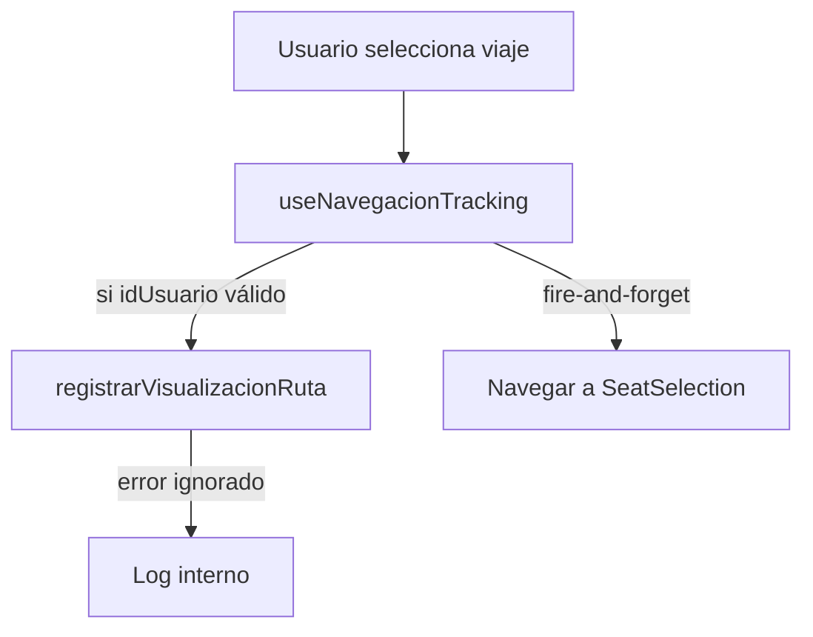

# Plan De Tracking De Navegación En App Móvil

## Contexto Detectado

La app `app-movil-pasajero` ya usa Apollo Client, React Navigation y `AuthContext` con `user.idUsuario`. El flujo principal de búsqueda está en [`src/screens/home/HomeScreen.tsx`](app-movil-pasajero/src/screens/home/HomeScreen.tsx) y la query real se ejecuta en [`src/screens/home/SearchResultsScreen.tsx`](app-movil-pasajero/src/screens/home/SearchResultsScreen.tsx). La selección de viaje se hace desde `TripCard` y navega a [`src/screens/home/SeatSelectionScreen.tsx`](app-movil-pasajero/src/screens/home/SeatSelectionScreen.tsx).

Archivos clave:
- [`src/graphql/queries/viajes.ts`](app-movil-pasajero/src/graphql/queries/viajes.ts): contiene `BUSCAR_VIAJES` sin `idUsuario`.
- [`src/context/AuthContext.tsx`](app-movil-pasajero/src/context/AuthContext.tsx): expone `useAuth()` y `user.idUsuario`.
- [`src/screens/home/SearchResultsScreen.tsx`](app-movil-pasajero/src/screens/home/SearchResultsScreen.tsx): ejecuta `BUSCAR_VIAJES` y navega al seleccionar `TripCard`.
- [`src/screens/home/BuscarImagenScreen.tsx`](app-movil-pasajero/src/screens/home/BuscarImagenScreen.tsx): también permite seleccionar viajes desde búsqueda visual.

## 1. Tipar La Query De Búsqueda

Actualizar [`src/graphql/queries/viajes.ts`](app-movil-pasajero/src/graphql/queries/viajes.ts):

- Añadir interfaces estrictas para los viajes disponibles y variables de búsqueda.
- Agregar `$idUsuario: Int` como variable opcional.
- Enviar `idUsuario: $idUsuario` al campo `buscarRutasYHorariosDisponibles`.

Fragmento propuesto:

```ts
export interface ViajeDisponible {
  idViaje: string;
  idRuta: string;
  ciudadOrigen: string;
  ciudadDestino: string;
  fechaHoraSalida: string;
  fechaHoraLlegada: string;
  duracionEstimadaHoras: number;
  precioBase: number;
  idBus: string;
  tipoBus: string;
  capacidadTotalAsientos: number;
  estadoViaje: string;
}

export interface BuscarViajesVars {
  origen: string;
  destino: string;
  fecha: string;
  idUsuario?: number;
}

export interface BuscarViajesData {
  buscarRutasYHorariosDisponibles: ViajeDisponible[];
}
```

Query:

```ts
export const BUSCAR_VIAJES = gql`
  query BuscarViajes($origen: String!, $destino: String!, $fecha: String!, $idUsuario: Int) {
    buscarRutasYHorariosDisponibles(
      origen: $origen
      destino: $destino
      fecha: $fecha
      idUsuario: $idUsuario
    ) {
      idViaje
      idRuta
      ciudadOrigen
      ciudadDestino
      fechaHoraSalida
      fechaHoraLlegada
      duracionEstimadaHoras
      precioBase
      idBus
      tipoBus
      capacidadTotalAsientos
      estadoViaje
    }
  }
`;
```

## 2. Crear Mutación GraphQL De Navegación

Crear [`src/graphql/mutations/navegacion.ts`](app-movil-pasajero/src/graphql/mutations/navegacion.ts):

```ts
import { gql } from '@apollo/client';

export interface RegistrarVisualizacionRutaVars {
  idUsuario: number;
  idRuta?: number;
  origen?: string;
  destino?: string;
  canal?: string;
}

export interface RegistrarVisualizacionRutaData {
  registrarVisualizacionRuta: boolean;
}

export const REGISTRAR_VISUALIZACION_RUTA = gql`
  mutation RegistrarVisualizacionRuta(
    $idUsuario: Int!
    $idRuta: Int
    $origen: String
    $destino: String
    $canal: String
  ) {
    registrarVisualizacionRuta(
      idUsuario: $idUsuario
      idRuta: $idRuta
      origen: $origen
      destino: $destino
      canal: $canal
    )
  }
`;
```

## 3. Crear Hook Fire-And-Forget Para Tracking

Crear [`src/hooks/useNavegacionTracking.ts`](app-movil-pasajero/src/hooks/useNavegacionTracking.ts).

Objetivo:
- Centralizar `useAuth()` + `useMutation`.
- Omitir llamadas si no existe `idUsuario`.
- Capturar errores con `try/catch` y `console.log`/`console.warn`, sin `Alert` ni UI de error.
- Devolver una función estable `registrarVisualizacionRuta`.

Fragmento propuesto:

```ts
export function useNavegacionTracking() {
  const { user } = useAuth();
  const [registrarVisualizacionMutation] = useMutation<
    RegistrarVisualizacionRutaData,
    RegistrarVisualizacionRutaVars
  >(REGISTRAR_VISUALIZACION_RUTA);

  const idUsuario = useMemo(() => {
    if (user?.idUsuario == null) return undefined;
    const parsed = Number(user.idUsuario);
    return Number.isFinite(parsed) ? parsed : undefined;
  }, [user?.idUsuario]);

  const registrarVisualizacionRuta = useCallback(
    async (input: Omit<RegistrarVisualizacionRutaVars, 'idUsuario' | 'canal'>) => {
      if (idUsuario == null) return;

      try {
        await registrarVisualizacionMutation({
          variables: {
            idUsuario,
            idRuta: input.idRuta,
            origen: input.origen,
            destino: input.destino,
            canal: 'APP_MOVIL',
          },
        });
      } catch (error) {
        console.log('[CU-13] No se pudo registrar visualización de ruta:', error);
      }
    },
    [idUsuario, registrarVisualizacionMutation]
  );

  return { idUsuario, registrarVisualizacionRuta };
}
```

## 4. Enviar `idUsuario` En La Búsqueda CU-01

Actualizar [`src/screens/home/SearchResultsScreen.tsx`](app-movil-pasajero/src/screens/home/SearchResultsScreen.tsx):

- Reemplazar `useQuery<any>` por tipos `BuscarViajesData, BuscarViajesVars`.
- Importar `useNavegacionTracking()`.
- Pasar `idUsuario` si existe; si no existe, dejarlo `undefined` para que Apollo no envíe un valor útil al backend.

Cambio conceptual:

```ts
const { idUsuario, registrarVisualizacionRuta } = useNavegacionTracking();

const { loading, error, data, refetch } = useQuery<BuscarViajesData, BuscarViajesVars>(
  BUSCAR_VIAJES,
  {
    variables: { origen, destino, fecha, idUsuario },
    fetchPolicy: 'network-only',
  }
);
```

Notas:
- El backend solo registrará `BUSQUEDA_RUTA` si `idUsuario` no es nulo.
- No conviene navegar con `idUsuario` como route param porque ya existe `AuthContext`.

## 5. Registrar Visualización Al Seleccionar Un Viaje

En [`src/screens/home/SearchResultsScreen.tsx`](app-movil-pasajero/src/screens/home/SearchResultsScreen.tsx), actualizar el `onPress` de `TripCard`:

```ts
onPress={() => {
  void registrarVisualizacionRuta({
    idRuta: Number(item.idRuta),
    origen: item.ciudadOrigen,
    destino: item.ciudadDestino,
  });

  navigation.navigate('SeatSelection', { idViaje: item.idViaje });
}}
```

Puntos importantes:
- Usar `void` para indicar explícitamente que la promesa no bloquea navegación.
- No mostrar errores al usuario si falla el tracking.
- Mantener navegación inmediata a `SeatSelection`.

## 6. Integrar Búsqueda Visual Si Aplica

[`src/screens/home/BuscarImagenScreen.tsx`](app-movil-pasajero/src/screens/home/BuscarImagenScreen.tsx) también renderiza `TripCard` y selecciona viajes con `handleSeleccionarViaje(viaje)`.

Plan recomendado:
- Importar `useNavegacionTracking()`.
- Reemplazar `any` en `handleSeleccionarViaje` y `renderItem` por `ViajeDisponible` reutilizado desde `viajes.ts`.
- Antes de emitir navegación, llamar fire-and-forget a `registrarVisualizacionRuta` con `idRuta`, `ciudadOrigen`, `ciudadDestino`.

Fragmento:

```ts
const handleSeleccionarViaje = (viaje: ViajeDisponible) => {
  void registrarVisualizacionRuta({
    idRuta: Number(viaje.idRuta),
    origen: viaje.ciudadOrigen,
    destino: viaje.ciudadDestino,
  });

  DeviceEventEmitter.emit('NAVIGATE_SEARCH_STACK', {
    screen: 'SeatSelection',
    params: { idViaje: String(viaje.idViaje) },
  });
};
```

Limitación:
- La búsqueda visual usa `buscarViajesPorDestinoTuristico`, que no registra `BUSQUEDA_RUTA` en backend. En esta fase solo se registraría la visualización al seleccionar el viaje. Registrar búsquedas turísticas requeriría extender el backend o una mutación adicional.

## 7. Sesión Y Usuario Autenticado

Usar el patrón existente de [`src/context/AuthContext.tsx`](app-movil-pasajero/src/context/AuthContext.tsx):

- `useAuth()` expone `user: UsuarioInfo | null`.
- `user.idUsuario` se normaliza con `Number(...)`.
- Si `user` es `null` o `idUsuario` no es válido, el hook no envía tracking.

No se recomienda modificar Apollo Client para headers/JWT en esta tarea porque el backend CU-13 recibe `idUsuario` explícito y la app ya usa ese patrón en CU-09 y reservas.

## 8. Tolerancia A Fallos

Reglas de implementación:
- El tracking de visualización debe ser fire-and-forget: `void registrarVisualizacionRuta(...)`.
- Errores capturados en el hook, sin `Alert.alert` ni estados visuales.
- La navegación a `SeatSelection` no debe depender de la mutación.
- Para búsqueda, si el backend no registra el evento, la query debe seguir funcionando igual.

Flujo esperado:



## 9. Pruebas Sugeridas

El proyecto no tiene script de test configurado actualmente en [`package.json`](app-movil-pasajero/package.json), así que primero se puede validar con TypeScript y pruebas manuales. Si se añade Jest más adelante, cubrir estos casos.

Validación estática:
- Ejecutar `npx tsc --noEmit` para confirmar tipos estrictos.

Pruebas manuales con backend levantado:
- Login normal en la app.
- Buscar rutas desde `HomeScreen`; verificar en logs/backend o DynamoDB que llega `BUSQUEDA_RUTA` con `id_usuario`.
- Seleccionar una tarjeta de viaje; verificar que se navega de inmediato a `SeatSelection` y se registra `VISUALIZACION_RUTA`.
- Simular usuario sin sesión o `idUsuario` inválido: la búsqueda debe funcionar sin enviar tracking.
- Apagar DynamoDB o forzar error backend: la UI no debe mostrar error de tracking ni bloquear navegación.

Pruebas unitarias futuras:
- `useNavegacionTracking` no llama mutación si `user` es `null`.
- `useNavegacionTracking` llama mutación con `canal: 'APP_MOVIL'` cuando hay `idUsuario`.
- `SearchResultsScreen` pasa `idUsuario` opcional en variables de `BUSCAR_VIAJES`.
- El `onPress` de `TripCard` dispara tracking y navegación sin esperar la promesa.

## Orden De Implementación

1. Tipar `ViajeDisponible`, `BuscarViajesData` y `BuscarViajesVars` en `viajes.ts`.
2. Actualizar `BUSCAR_VIAJES` para aceptar y enviar `idUsuario` opcional.
3. Crear `mutations/navegacion.ts` con `REGISTRAR_VISUALIZACION_RUTA`.
4. Crear `hooks/useNavegacionTracking.ts` con sesión, mutación y tolerancia a fallos.
5. Actualizar `SearchResultsScreen.tsx` para enviar `idUsuario` y registrar visualización al seleccionar viaje.
6. Actualizar `BuscarImagenScreen.tsx` para registrar visualización al seleccionar un viaje desde búsqueda visual.
7. Ejecutar `npx tsc --noEmit` y prueba manual con backend `core-transaccional` levantado.